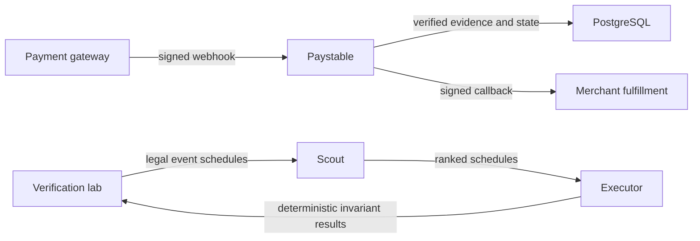

# Submission demonstration

This guide presents the shortest reproducible demonstration of Paystable and Scout.

## System boundary



Paystable protects the payment state and callback path. Scout ranks legal fault schedules. Deterministic invariants, not the model, decide whether a schedule found a failure.

## Three-minute order

1. Run the complete deterministic demonstration:

   ```bash
   go run ./testkit/lab demo
   ```

2. Show the program counts, search results, reduced failure traces, replay result, and repair check.
3. Run the independent implementation benchmark:

   ```bash
   go run ./testkit/lab independent 50 7
   ```

4. Explain the trust boundary: Scout selects schedules, but executable invariants label failures.
5. Show the external probe and genuine Test Mode evidence described in [Verification scope](verification-scope.md).

## Claims that the evidence supports

- The demonstration is reproducible with a fixed seed and budget.
- Scout ranks all known vulnerable demonstration programs within 10 schedules.
- Correct controls produce no invariant findings in the published runs.
- Failure traces replay deterministically and reduce to a 1-minimal schedule.
- The release gate checks application, PostgreSQL, webhook, callback, and network-failure paths.

## Limits

- The benchmark programs are synthetic and repository-authored.
- The independent implementations are not third-party systems.
- Two pinned third-party probes check narrow integration boundaries.
- One genuine Razorpay Test Mode webhook is evidence of integration, not production load.
- The published results do not guarantee accuracy on unseen production failures.
