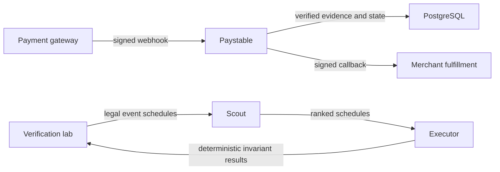

# Submission demonstration

This guide presents the shortest reproducible demonstration of Paystable and Scout.

## System boundary



Paystable protects the payment state and callback path. Scout ranks legal fault schedules. Deterministic invariants, not the model, decide whether a schedule found a failure.

## Three-minute order

1. Start Paystable on localhost.
2. Open the verification page:

   ```text
   http://localhost:8080/dashboard/verification
   ```

3. Select **Run verification**.
4. Explain the three trust steps: Scout ranks, the lab executes, and invariants prove.
5. Show the frozen held-out comparison.
6. State that standard Scout does not beat random on `Success@10`.
7. Show the duplicate-fulfillment trace and its 1-minimal schedule.
8. Read the evidence boundary before you finish.

Use the raw command after the visual demonstration when a reviewer wants the complete report:

```bash
go run ./testkit/lab demo
```

Run the independent implementation benchmark as a separate evidence check:

```bash
go run ./testkit/lab independent 50 7
```

The external probe and genuine Test Mode evidence are described in [Verification scope](verification-scope.md).

## Claims that the evidence supports

- The demonstration is reproducible with a fixed seed and budget.
- Scout ranks all 14 known vulnerable regression programs within 10 schedules.
- Correct controls produce no invariant findings in the published runs.
- Failure traces replay deterministically and reduce to a 1-minimal schedule.
- The release gate checks application, PostgreSQL, webhook, callback, and network-failure paths.

## Limits

- The benchmark programs are synthetic and repository-authored.
- The 14-of-14 result is regression evidence, not held-out evidence.
- The independent implementations are not third-party systems.
- The independent benchmark tests known-family transfer. It is not the final held-out benchmark.
- The frozen held-out set contains four vulnerable merchants and four correct controls.
- Standard Scout has median rank 2.5. Closed-loop Scout finds all four failures within three schedules.
- Two pinned third-party probes check narrow integration boundaries.
- One genuine Razorpay Test Mode webhook is evidence of integration, not production load.
- The published results do not guarantee accuracy on unseen production failures.
